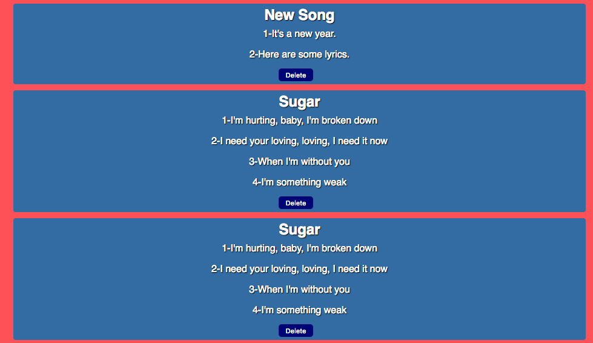

# LYRIC CREATOR

#### By Brian Dixon

##### Live app: https://briancapstoneclient.herokuapp.com/
##### server repo: https://github.com/thinkful-ei21/brian-reactcapstone-server

## Libraries and tools
- react.js, redux.js
- node.js, express.js
- mongoDB, mongoose.js
- bcrypt.js, passport.js, JWT auth
- Heroku for the server

##### Features
 This application was designed in order to help anyone jot down lyrics for a song and share them with the world, and open them for commentary. Normally it is difficult to send songs to Genius and allow them to feature your lyrics for the world to see. But now anyone is capable of doing this.

Type your lyrics into the 2 boxes named title and lyrics(leave spaces for lyrics).

just click on a lyric to get started commenting

